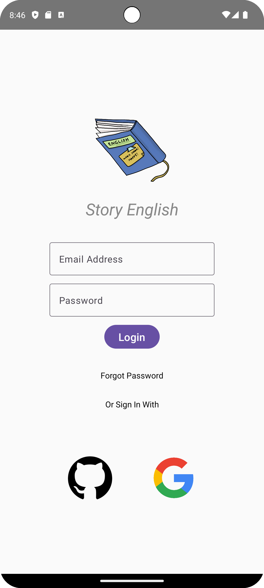

# Jetpack Compose ile Basit Bir Giriş Ekranı

Bu proje, Jetpack Compose kullanarak basit bir giriş ekranı oluşturmayı amaçlar. Geliştiriciler, bu proje üzerinden Jetpack Compose kullanımını öğrenerek kendi uygulamalarında giriş ekranlarını oluşturabilirler.

## Proje Yapısı

Proje, aşağıdaki ana bileşenleri içerir:

- **MainActivity.kt**: Giriş ekranının yer aldığı ana aktivite dosyası.
- **res/drawable**: Giriş ekranında kullanılan görsellerin bulunduğu klasör.
- **res/values/strings.xml**: Giriş ekranındaki metin kaynaklarının bulunduğu XML dosyası.

## Kullanılan Teknolojiler

Bu proje, aşağıdaki teknolojileri kullanır:

- **Jetpack Compose**: Modern bir Android UI toolkitidir. Gelişmiş ve esnek bir şekilde Android uygulamaları için kullanıcı arayüzleri oluşturmayı sağlar.

## Nasıl Çalıştırılır

Proje, Android Studio ile açılabilir. Android Studio'da "Open an Existing Project" seçeneğiyle projeyi açabilir ve ardından emülatörde veya fiziksel bir cihazda çalıştırabilirsiniz.

## **Ekran Görüntüsü**

## **Ekran Videosu**

## Katkıda Bulunma

Katkıda bulunmak isterseniz, lütfen bir pull istek gönderin. Her türlü katkı ve geri bildirim hoş geldiniz!

## Lisans

Bu proje MIT lisansı altında lisanslanmıştır. Daha fazla bilgi için [LİSANS](LICENSE) dosyasına bakın.
